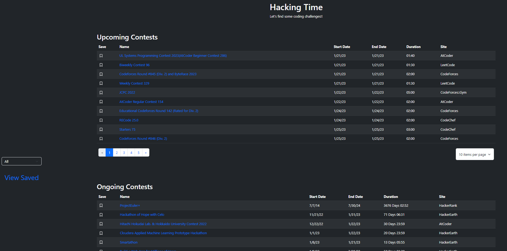
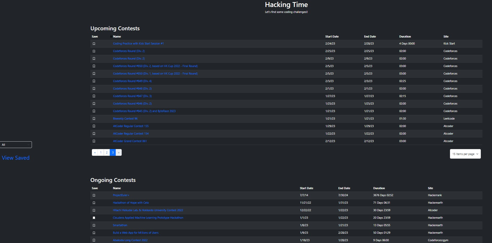
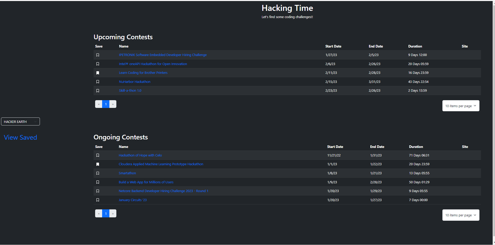
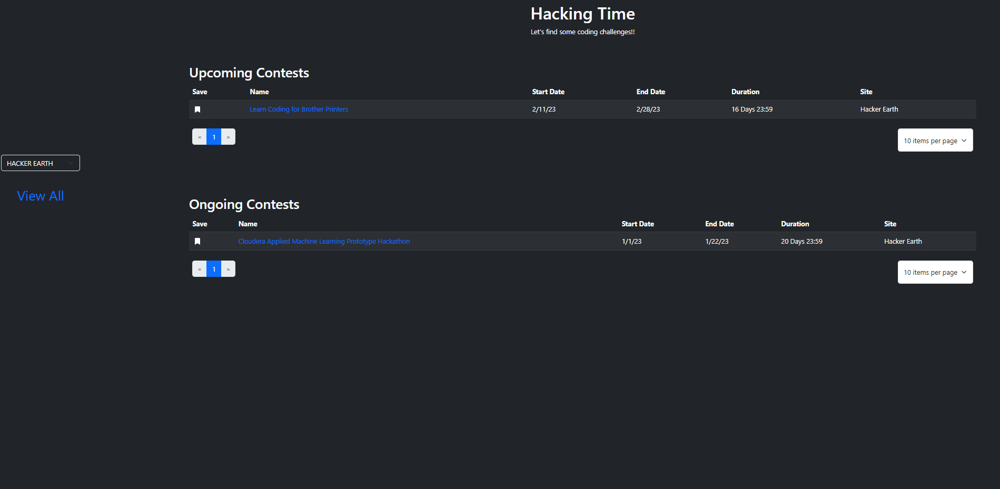

<h1>  Hacking Time! </h1>

[Live Site](https://hacking-time.netlify.app)

## Table of Contents
- [About](#about)
- [Project Overview](#project-overview)
- [Component Overview](#component-overview)

## About
 Angular application, used to find upcoming and ongoing coding contest from sites partnered with [Kontest API](https://kontests.net/api). 

## CLI Commands used
- `ng new front-end`
- `ng serve`
- `ng generate component components/[component name]`
- `ng generate pipe pipes/[pipe name]`
- `ng generate service services/[service naem]`
- `ng generate directive directives/[directive name]`
- `ng add [bootstrap/fortawesome]`
- `ng build`

## Project Overview

### Contests Tables 

> Tables are populated through a get request to the Kontests API.
 

> Utilized bootstrap to create the pagination and sortable funcionality of the tables 
 

> Able to filter tables based off chosen site 
>
### Saving Contest

> Contest can be saved by clicking the save icon and should populate on the saved tables when switching routes

## Component Overview

  ### contest-item
  - Renders the `td` for each contest
  - Inputs - (`contest` from `contests.component`) the contest object to display 
  - Outputs - (`onToggle` to `contests.componenet`) allows the us to toggle the saved property of the contest

 ### contests.component
- Renders the contest table and its pagination 
 - Uses a subscription to listen to the contest.service Subject (sends a get requests to the KnotestAPI and returns a Subject) when on the main page 
- When on the `/saved` page utilizes the `saved-contest.service` to retrieve saved contests instead of pinging the KontestAPI
- Input - type from `tables.component` used to devide if the table will display ongoing, or upcoming contests.
- the `th` use the sortable directive, based off bootstrap`s documentation 
- utilizes bootstrap`s pagination module to set up the pagination
- stores the toggleSave function passed to `contest-item.component` to toggle saved contest

 ### options.component 
- Renders the site filter options and the link to switch saved and home views
- Utilizes the `site.service` to send a get request to the Kontest API and retrieve the available site options to filter the tables by
- filters the table by using the `contest.service` to refresh the contests by sending a get request only returning the selected sites contests

### tables.component 
- Renders the `contest.component`, only added to have a component to mount on the routes for the Router

